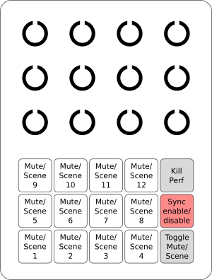

# Analog-Rytm-Controller
A powerfull MIDI controller for the Elektron Analog Rytm

This repository contains the firmware files for building a MIDI controller for the Elektron Analog Rytm.
The firmware is based on the [MIDIBox project](http://www.ucapps.de) and can be built using the STM32F4 or STM32 MIDIBox Core module.
Due to the simplicity of the circuit, the whole project can be built using a STM32F4 Discovery board,
with the additional circuitry soldered to perfboard/protoboard PCBs.

## Features

The controller helps you to change track mutes, scenes and performance macros
without having to switch the pages on the Rytm.
Have you ever felt you need more than two hands to switch patterns and settings
on multiple devices at the same time? This controller makes your live easier by
queueing your changes and executing them in sync with the tempo. Now you can have
your hands free to tweak other gear in the critical seconds of a song.

- control performance macros
- mute and un-mute the performance macros with a kill switch
- control track mute states
- control scene changes
- Feedback from the Rytm via MIDI (it mirrors the settings currently
    active on the Rytm)
- apply the changes immediately or in sync with the tempo
  (queue track mutes, scene changes and performance kill)
- can be synced to the Rytms own MIDI clock or an external MIDI clock

## Interface and usage

The control surface consists of a bank of 3x4 potentiometers and a bank of 3x5 illuminated buttons.

### General usage

The potentiometers can be used to control the performance macros of the Analog Rytm.
Instead of pressing on the pads of the Rytm you can simply turn the knobs to
alter the sound of your drums.
The Kill button can be pressed to reset all performance macros to zero. When the button is pressed
a second time, the macros are reset back to the state of the potentiometers. This can be used to
create build-ups and quickly reset the changes on the start of a new bar.
Individual potentiometers can be excluded from the performance kill via the settings.

When the Mute/Scene-toggle button is illuminated, the 12 Scene/Mute buttons
control the mute state of the 12 drum tracks. They operate exactly like the pads on the
Rytm when the Rytm is in Mute Mode.

When the Mute/Scene-toggle button is not illuminated, the 12 Scene/Mute buttons
control the active scene. They operate exactly like the pads on the
Rytm, when the Rytm is in Scene Mode.

### Syncing to the tempo

The key difference to the Rytm itself is that track mutes, scene changes and
the performance kill can be synced to the tempo. To enable the sync feature,
press the sync button until it is lit. The sync button will pulse when no clock
signal is present. Once the clock signal is running, it will be illuminated. A
brief flash indicates the timepoints where the sync events are executed.

With the sync mode enabled, all changes to the track mutes, the active scene and
the performance kill will not be executed immediately. Instead, they are queued
and executed as soon as the end of the sync cycle is reached. The length of the
sync cycle can be adjusted in the settings.

### Connections

The device is powered from a USB jack.
There are four MIDI ports.
| jack     | usage                                                      |
| -------- | ---------------------------------------------------------- |
MIDI 1 In  | Data from here will be forwarded to the Rytm.
MIDI 1 Out | This is a THRU port for MIDI 1 In (if clocked externally) or a THRU port for MIDI 2 In (if clocked from the Rytm)
MIDI 2 In  | Connect this to the Rytms MIDI Out for feedback over over the track mute states (and for syncing to the Rytms clock output, if that is the selected sync source)
MIDI 2 Out | Connect this to the Rytms MIDI Input

### changing the settings

#### Settings page 1: Performance kill settings

Pressing the Sync button and the Mute/Scene-toggle button at the same time brings
up the first page of settings. The Sync button will be illuminated and the Kill
button flashes.

Now you can use the 12 Mute/Scene buttons to select, which of
the potentiometers will be affected by the performance kill. An illuminated button
indicates that the corresponding potentiometer will be affected.

#### Settings page 2: sync settings

Pressing the Sync and Mute/Scene-toggle button combo again brings up the second
page of settings. The Sync button will be illuminated and the Mute/Scene-toggle
button flashes. Now you can edit the sync settings.

The Kill button toggles the clock source between the Rytms clock (button not
illuminated) and external clock (button illuminated).

Mute/Scene buttons 1-4 control the denominator of the sync cycle.

| Button 1      | Button 2      | Button 3      | Button 4      |      
| ------------- | ------------- | ------------- | ------------- |
| 1/16th note   | 1/8th note    | 1/4 note      | 1/2 note      |

Mute/Scene buttons 4-12 control the nominator of the sync cycle. Here, the
button number corresponds to the nominator directly.

To sync the changes to the beginning of a 4/4 bar, select button 4 and button 3
(this corresponds to 4 1/4 notes == 1 full bar). Alternatively you can select
button 8 and button 2 (this corresponds to 8 1/8th notes == 1 full bar).
Similarly, to sync you changes to a 7/16th cycle, select buttons 7 and 1.

#### Saving the settings

Pressing the Sync and Mute/Scene-toggle button combo a third time will save the
settings and quit the settings mode. Please note that the current state of the
Mute/Scene-toggle button will be saved as well. This will affect, if the device
starts up in the mute mode or the scene mode.

## Building one

The build follows the [MIDIBox Hardware specifications](http://www.ucapps.de).
There are additional instructions in [the app.c source code file](firmware/app.c)
I will put online a build guide later.
